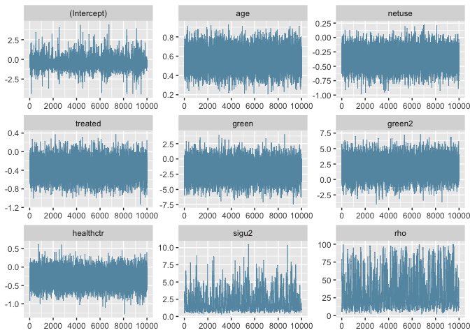

<!-- README.md is generated from README.Rmd. Please edit that file -->

# spbridge: Marginally interpretable spatial logistic regression with bridge processes

This is a R software repository corresponding to the manuscript

> “Marginally interpretable spatial logistic regression with bridge
> processes” by Changwoo Lee and David B. Dunson

See R folder for the functions, which contains

- bridge.R: univariate and multivariate bridge distribution and normal
  variance mixing distributions
- splogi_bridge.R: spatial logistic model with bridge process random
  effect, using Matern kernel
- splogi_bridge_lowrank.R: spatial logistic model with bridge process
  random effect, using low-rank Matern kernel
- splogi_gaussian.R: spatial logistic model with Gaussian process random
  effect, using Matern kernel
- splogi_gaussian_lowrank.R: spatial logistic model with Gaussian
  process random effect, using low-rank Matern kernel

<!-- badges: start -->
<!-- badges: end -->

## Motivation

Consider the following logistic mixed model with a spatial random effect
for spatially indexed binary data:

$$
\mathrm{logit}\{\mathrm{Pr}(Y_{ij} = 1 \mid x_{ij}, u(s_i))\} = x_{ij}^T\beta + u(s_i), \quad u(\cdot)\sim \text{ mean zero process}
$$

where $i=1,\dots,n$, $j=1,\dots,N_i$, $Y_{ij}$ is a binary response at
location $i$ and individual $j$, $x_{ij}$ is a vector of covariates,
$\beta$ is a vector of regression coefficients, and $u(s_i)$ is a
spatial random effect at location $s_i$. When $N_i=1$ for all $i$, this
reduces to point-referenced spatial binary data.

The random effect $u(\cdot)$, a mean zero stochastic process defined on
the whole spatial domain, accounts for spatial dependence and allows for
prediction at new location in a coherent probabilistic framework. The
most popular choice of $u(\cdot)$ is the Gaussian process.

However, by adding the random effect, the log-odds interpretation of
$\beta$ is changed from population-averaged to site-specific. In other
words, $\beta$ now represents the change in the log-odds of $Y$
associated with a 1-unit increase of $x$, holding the site fixed. This
is in contrast with population-averaged interpretation from the model
$\mathrm{logit}\{\mathrm{Pr}(Y_{ij} = 1 \mid x_{ij})\} = x_{ij}^T\beta^M$
(as usual interpretation in logistic regression without random effects),
where $\beta^M$ represents the change in the log-odds of $Y$ associated
with a 1-unit increase of $x$ without conditioning on the site. When
$u(\cdot)$ is a Gaussian process, the induced model for
$\mathrm{logit}\{\mathrm{Pr}(Y_{ij} = 1 \mid x_{ij})\}$ is no longer a
linear function of $x_{ij}$, and marginal interpretation of regression
coefficient is lost.

We develop marginally interpretable spatial logistic model for
researchers who wish **(1) population-averaged log-odds interpretation
of regression parameters, (2) taking account of spatial dependence (3)
prediction of probability of $Y$ at a new location, all in a single
modeling framework**. Based on the work of [Wang and Louis
(2003)](#references), we propose a novel stochastic process called
bridge process for spatial random effects based on normal scale mixture
that allows marginal interpretation of regression coefficients in
spatial logistic regression. Under a Bayesian framework, the inference
is carried out with highly efficient MCMC algorithm leveraging normal
mixture representation and Polya-Gamma data augmentation [(Polson et
al., 2013)](#references).

## Case study: Childhood malaria in the Gambia

We analyze childhood malaria prevalence data in the Gambia. It contains
$\sum_{i=1}^n N_i = 2035$ children’s malaria infection statuses from
$n=65$ villages, along with covariates including age, bed net use, net
treatment with insecticides, a satellite-derived measure of greenness,
and the presence of a health center in the villages. The study of
population-averaged associations between malaria prevalence and
covariates is useful for nationwide decision-making; for example, on
supplying bed nets. Prediction of malaria prevalence at new locations is
also of substantial interest.

### 1. Data preparation

We first load data from geoR package, and standardize the data following
[Gelman et al (2008)](#references).

``` r
library(geoR)# read the data 
#> --------------------------------------------------------------
#>  Analysis of Geostatistical Data
#>  For an Introduction to geoR go to http://www.leg.ufpr.br/geoR
#>  geoR version 1.9-4 (built on 2024-02-14) is now loaded
#> --------------------------------------------------------------
data(gambia)
N = length(gambia$pos) # 2035
y = gambia$pos # binary response, N = 2035 by 1 vector
# define id based on spatial coords unique values
id = as.numeric(factor(paste(gambia$x, gambia$y))) 
n = length(unique(id)) # 65
coords = unique(cbind(gambia$x, gambia$y)/1000) # n by 2 matrix, in km

# standardized covariates following Gelman et al (2008)
intercept = rep(1,N) # intercept
age = scale(gambia$age/365, scale = 2*sd(gambia$age/365)) # in years
netuse = gambia$netuse - mean(gambia$netuse)
treated = gambia$treated - mean(gambia$treated)
green = scale(gambia$green, scale = 2*sd(gambia$green))
green2 = scale(gambia$green^2, scale = 2*sd(gambia$green^2))
healthctr = gambia$phc - mean(gambia$phc)

X = cbind(intercept, age, netuse, treated, green, green2, healthctr)
colnames(X) = c("(Intercept)", "age", "netuse", "treated", "green", "green2", "healthctr")

centers = c(attr(age, "scaled:center"), mean(gambia$netuse), mean(gambia$treated), 
            attr(green, "scaled:center"), attr(green2, "scaled:center"), mean(gambia$phc))
scales = c(attr(age, "scaled:scale"), 1, 1, attr(green, "scaled:scale"), attr(green2, "scaled:scale"), 1)
  
```

### 2. Fit the model

Now we fit the spatial logistic model with bridge process random effect
for inference of both $\beta^M$ and $\beta$, as well as Gaussian process
random effects for comparison of site-specific estimate $\beta$. We
closely followed the choice of prior suggested by [Gelman
(2006)](#references) and [Gelman et al (2008)](#references), e.g. Cauchy
prior for regression coefficients; see the manuscript for detailed
settings. Running times are less than 2 mins for 11,000 iteration under
Apple M1 CPU environment.

``` r
source("R/bridge.R")
source("R/miscfunctions.R")
source("R/splogi_bridge.R")
source("R/splogi_gaussian.R")
```

``` r
# spatial logistic model with bridge process random effect
fit_bridge = splogi_bridge(y = y,
                   X = X,
                   id = id,
                   priors = list(beta_intercept_scale = 10,
                                 beta_scale = 2.5, beta_df = Inf, 
                                 rho_lb = 0.01, rho_ub = 100),
                   coords = coords,
                   smoothness = 0.5, nburn = 1000, nsave = 10000, nthin = 1)
#>   |                                                                              |                                                                      |   0%  |                                                                              |                                                                      |   1%  |                                                                              |=                                                                     |   1%  |                                                                              |=                                                                     |   2%  |                                                                              |==                                                                    |   2%  |                                                                              |==                                                                    |   3%  |                                                                              |==                                                                    |   4%  |                                                                              |===                                                                   |   4%  |                                                                              |===                                                                   |   5%  |                                                                              |====                                                                  |   5%  |                                                                              |====                                                                  |   6%  |                                                                              |=====                                                                 |   6%  |                                                                              |=====                                                                 |   7%  |                                                                              |=====                                                                 |   8%  |                                                                              |======                                                                |   8%  |                                                                              |======                                                                |   9%  |                                                                              |=======                                                               |   9%  |                                                                              |=======                                                               |  10%  |                                                                              |=======                                                               |  11%  |                                                                              |========                                                              |  11%  |                                                                              |========                                                              |  12%  |                                                                              |=========                                                             |  12%  |                                                                              |=========                                                             |  13%  |                                                                              |=========                                                             |  14%  |                                                                              |==========                                                            |  14%  |                                                                              |==========                                                            |  15%  |                                                                              |===========                                                           |  15%  |                                                                              |===========                                                           |  16%  |                                                                              |============                                                          |  16%  |                                                                              |============                                                          |  17%  |                                                                              |============                                                          |  18%  |                                                                              |=============                                                         |  18%  |                                                                              |=============                                                         |  19%  |                                                                              |==============                                                        |  19%  |                                                                              |==============                                                        |  20%  |                                                                              |==============                                                        |  21%  |                                                                              |===============                                                       |  21%  |                                                                              |===============                                                       |  22%  |                                                                              |================                                                      |  22%  |                                                                              |================                                                      |  23%  |                                                                              |================                                                      |  24%  |                                                                              |=================                                                     |  24%  |                                                                              |=================                                                     |  25%  |                                                                              |==================                                                    |  25%  |                                                                              |==================                                                    |  26%  |                                                                              |===================                                                   |  26%  |                                                                              |===================                                                   |  27%  |                                                                              |===================                                                   |  28%  |                                                                              |====================                                                  |  28%  |                                                                              |====================                                                  |  29%  |                                                                              |=====================                                                 |  29%  |                                                                              |=====================                                                 |  30%  |                                                                              |=====================                                                 |  31%  |                                                                              |======================                                                |  31%  |                                                                              |======================                                                |  32%  |                                                                              |=======================                                               |  32%  |                                                                              |=======================                                               |  33%  |                                                                              |=======================                                               |  34%  |                                                                              |========================                                              |  34%  |                                                                              |========================                                              |  35%  |                                                                              |=========================                                             |  35%  |                                                                              |=========================                                             |  36%  |                                                                              |==========================                                            |  36%  |                                                                              |==========================                                            |  37%  |                                                                              |==========================                                            |  38%  |                                                                              |===========================                                           |  38%  |                                                                              |===========================                                           |  39%  |                                                                              |============================                                          |  39%  |                                                                              |============================                                          |  40%  |                                                                              |============================                                          |  41%  |                                                                              |=============================                                         |  41%  |                                                                              |=============================                                         |  42%  |                                                                              |==============================                                        |  42%  |                                                                              |==============================                                        |  43%  |                                                                              |==============================                                        |  44%  |                                                                              |===============================                                       |  44%  |                                                                              |===============================                                       |  45%  |                                                                              |================================                                      |  45%  |                                                                              |================================                                      |  46%  |                                                                              |=================================                                     |  46%  |                                                                              |=================================                                     |  47%  |                                                                              |=================================                                     |  48%  |                                                                              |==================================                                    |  48%  |                                                                              |==================================                                    |  49%  |                                                                              |===================================                                   |  49%  |                                                                              |===================================                                   |  50%  |                                                                              |===================================                                   |  51%  |                                                                              |====================================                                  |  51%  |                                                                              |====================================                                  |  52%  |                                                                              |=====================================                                 |  52%  |                                                                              |=====================================                                 |  53%  |                                                                              |=====================================                                 |  54%  |                                                                              |======================================                                |  54%  |                                                                              |======================================                                |  55%  |                                                                              |=======================================                               |  55%  |                                                                              |=======================================                               |  56%  |                                                                              |========================================                              |  56%  |                                                                              |========================================                              |  57%  |                                                                              |========================================                              |  58%  |                                                                              |=========================================                             |  58%  |                                                                              |=========================================                             |  59%  |                                                                              |==========================================                            |  59%  |                                                                              |==========================================                            |  60%  |                                                                              |==========================================                            |  61%  |                                                                              |===========================================                           |  61%  |                                                                              |===========================================                           |  62%  |                                                                              |============================================                          |  62%  |                                                                              |============================================                          |  63%  |                                                                              |============================================                          |  64%  |                                                                              |=============================================                         |  64%  |                                                                              |=============================================                         |  65%  |                                                                              |==============================================                        |  65%  |                                                                              |==============================================                        |  66%  |                                                                              |===============================================                       |  66%  |                                                                              |===============================================                       |  67%  |                                                                              |===============================================                       |  68%  |                                                                              |================================================                      |  68%  |                                                                              |================================================                      |  69%  |                                                                              |=================================================                     |  69%  |                                                                              |=================================================                     |  70%  |                                                                              |=================================================                     |  71%  |                                                                              |==================================================                    |  71%  |                                                                              |==================================================                    |  72%  |                                                                              |===================================================                   |  72%  |                                                                              |===================================================                   |  73%  |                                                                              |===================================================                   |  74%  |                                                                              |====================================================                  |  74%  |                                                                              |====================================================                  |  75%  |                                                                              |=====================================================                 |  75%  |                                                                              |=====================================================                 |  76%  |                                                                              |======================================================                |  76%  |                                                                              |======================================================                |  77%  |                                                                              |======================================================                |  78%  |                                                                              |=======================================================               |  78%  |                                                                              |=======================================================               |  79%  |                                                                              |========================================================              |  79%  |                                                                              |========================================================              |  80%  |                                                                              |========================================================              |  81%  |                                                                              |=========================================================             |  81%  |                                                                              |=========================================================             |  82%  |                                                                              |==========================================================            |  82%  |                                                                              |==========================================================            |  83%  |                                                                              |==========================================================            |  84%  |                                                                              |===========================================================           |  84%  |                                                                              |===========================================================           |  85%  |                                                                              |============================================================          |  85%  |                                                                              |============================================================          |  86%  |                                                                              |=============================================================         |  86%  |                                                                              |=============================================================         |  87%  |                                                                              |=============================================================         |  88%  |                                                                              |==============================================================        |  88%  |                                                                              |==============================================================        |  89%  |                                                                              |===============================================================       |  89%  |                                                                              |===============================================================       |  90%  |                                                                              |===============================================================       |  91%  |                                                                              |================================================================      |  91%  |                                                                              |================================================================      |  92%  |                                                                              |=================================================================     |  92%  |                                                                              |=================================================================     |  93%  |                                                                              |=================================================================     |  94%  |                                                                              |==================================================================    |  94%  |                                                                              |==================================================================    |  95%  |                                                                              |===================================================================   |  95%  |                                                                              |===================================================================   |  96%  |                                                                              |====================================================================  |  96%  |                                                                              |====================================================================  |  97%  |                                                                              |====================================================================  |  98%  |                                                                              |===================================================================== |  98%  |                                                                              |===================================================================== |  99%  |                                                                              |======================================================================|  99%  |                                                                              |======================================================================| 100%
fit_bridge$t_mcmc
#> Time difference of 107.9764 secs
# spatial logistic model with Gaussian process random effect
fit_gaussian = splogi_gaussian(y = y,
                   X = X,
                   id = id,
                   priors = list(beta_intercept_scale = 10,
                                 beta_scale = 2.5, beta_df = Inf, 
                                 rho_lb = 0.01, rho_ub = 100),
                   coords = coords,
                   smoothness = 0.5, nburn = 1000, nsave = 10000, nthin = 1)
#>   |                                                                              |                                                                      |   0%  |                                                                              |                                                                      |   1%  |                                                                              |=                                                                     |   1%  |                                                                              |=                                                                     |   2%  |                                                                              |==                                                                    |   2%  |                                                                              |==                                                                    |   3%  |                                                                              |==                                                                    |   4%  |                                                                              |===                                                                   |   4%  |                                                                              |===                                                                   |   5%  |                                                                              |====                                                                  |   5%  |                                                                              |====                                                                  |   6%  |                                                                              |=====                                                                 |   6%  |                                                                              |=====                                                                 |   7%  |                                                                              |=====                                                                 |   8%  |                                                                              |======                                                                |   8%  |                                                                              |======                                                                |   9%  |                                                                              |=======                                                               |   9%  |                                                                              |=======                                                               |  10%  |                                                                              |=======                                                               |  11%  |                                                                              |========                                                              |  11%  |                                                                              |========                                                              |  12%  |                                                                              |=========                                                             |  12%  |                                                                              |=========                                                             |  13%  |                                                                              |=========                                                             |  14%  |                                                                              |==========                                                            |  14%  |                                                                              |==========                                                            |  15%  |                                                                              |===========                                                           |  15%  |                                                                              |===========                                                           |  16%  |                                                                              |============                                                          |  16%  |                                                                              |============                                                          |  17%  |                                                                              |============                                                          |  18%  |                                                                              |=============                                                         |  18%  |                                                                              |=============                                                         |  19%  |                                                                              |==============                                                        |  19%  |                                                                              |==============                                                        |  20%  |                                                                              |==============                                                        |  21%  |                                                                              |===============                                                       |  21%  |                                                                              |===============                                                       |  22%  |                                                                              |================                                                      |  22%  |                                                                              |================                                                      |  23%  |                                                                              |================                                                      |  24%  |                                                                              |=================                                                     |  24%  |                                                                              |=================                                                     |  25%  |                                                                              |==================                                                    |  25%  |                                                                              |==================                                                    |  26%  |                                                                              |===================                                                   |  26%  |                                                                              |===================                                                   |  27%  |                                                                              |===================                                                   |  28%  |                                                                              |====================                                                  |  28%  |                                                                              |====================                                                  |  29%  |                                                                              |=====================                                                 |  29%  |                                                                              |=====================                                                 |  30%  |                                                                              |=====================                                                 |  31%  |                                                                              |======================                                                |  31%  |                                                                              |======================                                                |  32%  |                                                                              |=======================                                               |  32%  |                                                                              |=======================                                               |  33%  |                                                                              |=======================                                               |  34%  |                                                                              |========================                                              |  34%  |                                                                              |========================                                              |  35%  |                                                                              |=========================                                             |  35%  |                                                                              |=========================                                             |  36%  |                                                                              |==========================                                            |  36%  |                                                                              |==========================                                            |  37%  |                                                                              |==========================                                            |  38%  |                                                                              |===========================                                           |  38%  |                                                                              |===========================                                           |  39%  |                                                                              |============================                                          |  39%  |                                                                              |============================                                          |  40%  |                                                                              |============================                                          |  41%  |                                                                              |=============================                                         |  41%  |                                                                              |=============================                                         |  42%  |                                                                              |==============================                                        |  42%  |                                                                              |==============================                                        |  43%  |                                                                              |==============================                                        |  44%  |                                                                              |===============================                                       |  44%  |                                                                              |===============================                                       |  45%  |                                                                              |================================                                      |  45%  |                                                                              |================================                                      |  46%  |                                                                              |=================================                                     |  46%  |                                                                              |=================================                                     |  47%  |                                                                              |=================================                                     |  48%  |                                                                              |==================================                                    |  48%  |                                                                              |==================================                                    |  49%  |                                                                              |===================================                                   |  49%  |                                                                              |===================================                                   |  50%  |                                                                              |===================================                                   |  51%  |                                                                              |====================================                                  |  51%  |                                                                              |====================================                                  |  52%  |                                                                              |=====================================                                 |  52%  |                                                                              |=====================================                                 |  53%  |                                                                              |=====================================                                 |  54%  |                                                                              |======================================                                |  54%  |                                                                              |======================================                                |  55%  |                                                                              |=======================================                               |  55%  |                                                                              |=======================================                               |  56%  |                                                                              |========================================                              |  56%  |                                                                              |========================================                              |  57%  |                                                                              |========================================                              |  58%  |                                                                              |=========================================                             |  58%  |                                                                              |=========================================                             |  59%  |                                                                              |==========================================                            |  59%  |                                                                              |==========================================                            |  60%  |                                                                              |==========================================                            |  61%  |                                                                              |===========================================                           |  61%  |                                                                              |===========================================                           |  62%  |                                                                              |============================================                          |  62%  |                                                                              |============================================                          |  63%  |                                                                              |============================================                          |  64%  |                                                                              |=============================================                         |  64%  |                                                                              |=============================================                         |  65%  |                                                                              |==============================================                        |  65%  |                                                                              |==============================================                        |  66%  |                                                                              |===============================================                       |  66%  |                                                                              |===============================================                       |  67%  |                                                                              |===============================================                       |  68%  |                                                                              |================================================                      |  68%  |                                                                              |================================================                      |  69%  |                                                                              |=================================================                     |  69%  |                                                                              |=================================================                     |  70%  |                                                                              |=================================================                     |  71%  |                                                                              |==================================================                    |  71%  |                                                                              |==================================================                    |  72%  |                                                                              |===================================================                   |  72%  |                                                                              |===================================================                   |  73%  |                                                                              |===================================================                   |  74%  |                                                                              |====================================================                  |  74%  |                                                                              |====================================================                  |  75%  |                                                                              |=====================================================                 |  75%  |                                                                              |=====================================================                 |  76%  |                                                                              |======================================================                |  76%  |                                                                              |======================================================                |  77%  |                                                                              |======================================================                |  78%  |                                                                              |=======================================================               |  78%  |                                                                              |=======================================================               |  79%  |                                                                              |========================================================              |  79%  |                                                                              |========================================================              |  80%  |                                                                              |========================================================              |  81%  |                                                                              |=========================================================             |  81%  |                                                                              |=========================================================             |  82%  |                                                                              |==========================================================            |  82%  |                                                                              |==========================================================            |  83%  |                                                                              |==========================================================            |  84%  |                                                                              |===========================================================           |  84%  |                                                                              |===========================================================           |  85%  |                                                                              |============================================================          |  85%  |                                                                              |============================================================          |  86%  |                                                                              |=============================================================         |  86%  |                                                                              |=============================================================         |  87%  |                                                                              |=============================================================         |  88%  |                                                                              |==============================================================        |  88%  |                                                                              |==============================================================        |  89%  |                                                                              |===============================================================       |  89%  |                                                                              |===============================================================       |  90%  |                                                                              |===============================================================       |  91%  |                                                                              |================================================================      |  91%  |                                                                              |================================================================      |  92%  |                                                                              |=================================================================     |  92%  |                                                                              |=================================================================     |  93%  |                                                                              |=================================================================     |  94%  |                                                                              |==================================================================    |  94%  |                                                                              |==================================================================    |  95%  |                                                                              |===================================================================   |  95%  |                                                                              |===================================================================   |  96%  |                                                                              |====================================================================  |  96%  |                                                                              |====================================================================  |  97%  |                                                                              |====================================================================  |  98%  |                                                                              |===================================================================== |  98%  |                                                                              |===================================================================== |  99%  |                                                                              |======================================================================|  99%  |                                                                              |======================================================================| 100%
fit_gaussian$t_mcmc
#> Time difference of 78.13987 secs
```

### 3. Summarize the result

Now we summarize the MCMC results after back-transforming the data in
the original scale. The conditional estimates are essentially identical.
From the proposed model, we also obtain parameters with
population-averaged interpretation as well that are comparable with
results of [Cattelan and Varin (2018)](#references). The trace plot
shows good convergence.

``` r
scaleback <- function(x, centers, scales){
  c(x[1] - sum((x[-1] * centers) / scales),
    x[-1] / scales)
}

# summary from bridge process
beta_b_save = fit_bridge$post_save[,1:ncol(X)]
beta_b_save_orig = coda::mcmc(t(apply(beta_b_save, 1, scaleback, centers, scales)))
betam_b_save_orig = coda::mcmc(t(apply(fit_bridge$betam_save, 1, scaleback, centers, scales)))


summary(betam_b_save_orig)# population-averaged, bridge process random effect
#> 
#> Iterations = 1:10000
#> Thinning interval = 1 
#> Number of chains = 1 
#> Sample size per chain = 10000 
#> 
#> 1. Empirical mean and standard deviation for each variable,
#>    plus standard error of the mean:
#> 
#>                  Mean        SD  Naive SE Time-series SE
#> (Intercept)  1.684356 2.2757266 2.276e-02      3.250e-02
#> age          0.183834 0.0490870 4.909e-04      1.271e-03
#> netuse      -0.272706 0.1314882 1.315e-03      2.302e-03
#> treated     -0.267932 0.1629853 1.630e-03      2.569e-03
#> green       -0.094692 0.0874361 8.744e-04      1.255e-03
#> green2       0.001011 0.0009136 9.136e-06      1.533e-05
#> healthctr   -0.224382 0.1798931 1.799e-03      2.219e-03
#> 
#> 2. Quantiles for each variable:
#> 
#>                  2.5%        25%        50%       75%     97.5%
#> (Intercept) -2.887241  0.2185615  1.6748386  3.182709  6.128587
#> age          0.093709  0.1493034  0.1821594  0.216173  0.284592
#> netuse      -0.552696 -0.3549653 -0.2634363 -0.179722 -0.036838
#> treated     -0.609028 -0.3726459 -0.2574459 -0.156727  0.027807
#> green       -0.271624 -0.1508802 -0.0934191 -0.037127  0.076580
#> green2      -0.000746  0.0004056  0.0009896  0.001602  0.002873
#> healthctr   -0.597299 -0.3356159 -0.2176821 -0.105792  0.117813

summary(beta_b_save_orig)# site(subject)-specific, bridge process random effect 
#> 
#> Iterations = 1:10000
#> Thinning interval = 1 
#> Number of chains = 1 
#> Sample size per chain = 10000 
#> 
#> 1. Empirical mean and standard deviation for each variable,
#>    plus standard error of the mean:
#> 
#>                  Mean       SD  Naive SE Time-series SE
#> (Intercept)  2.296844 2.979827 2.980e-02      4.319e-02
#> age          0.244919 0.045065 4.506e-04      5.279e-04
#> netuse      -0.362932 0.157220 1.572e-03      1.697e-03
#> treated     -0.356505 0.201271 2.013e-03      2.335e-03
#> green       -0.127281 0.112560 1.126e-03      1.530e-03
#> green2       0.001352 0.001169 1.169e-05      1.578e-05
#> healthctr   -0.298891 0.227370 2.274e-03      2.412e-03
#> 
#> 2. Quantiles for each variable:
#> 
#>                   2.5%        25%       50%       75%     97.5%
#> (Intercept) -3.7190373  0.2932544  2.358541  4.335769  7.915982
#> age          0.1566458  0.2142897  0.245124  0.275090  0.334035
#> netuse      -0.6724324 -0.4691827 -0.362660 -0.258004 -0.054288
#> treated     -0.7518594 -0.4891473 -0.356723 -0.221044  0.038372
#> green       -0.3389959 -0.2054096 -0.131088 -0.051433  0.099836
#> green2      -0.0009896  0.0005603  0.001379  0.002163  0.003564
#> healthctr   -0.7519898 -0.4492416 -0.303842 -0.149316  0.159139

# Compare with Gaussian process random effects model
beta_g_save = fit_gaussian$post_save[,1:ncol(X)]
beta_g_save_orig = coda::mcmc(t(apply(beta_g_save, 1, scaleback, centers, scales)))
summary(beta_g_save_orig)# site(subject)-specific, Gaussian process random effect
#> 
#> Iterations = 1:10000
#> Thinning interval = 1 
#> Number of chains = 1 
#> Sample size per chain = 10000 
#> 
#> 1. Empirical mean and standard deviation for each variable,
#>    plus standard error of the mean:
#> 
#>                  Mean       SD  Naive SE Time-series SE
#> (Intercept)  2.442503 2.763544 2.764e-02      4.008e-02
#> age          0.244214 0.044467 4.447e-04      5.230e-04
#> netuse      -0.360414 0.158588 1.586e-03      1.721e-03
#> treated     -0.363493 0.198053 1.981e-03      2.323e-03
#> green       -0.133897 0.104779 1.048e-03      1.308e-03
#> green2       0.001428 0.001102 1.102e-05      1.319e-05
#> healthctr   -0.296428 0.213653 2.137e-03      2.269e-03
#> 
#> 2. Quantiles for each variable:
#> 
#>                  2.5%        25%      50%       75%     97.5%
#> (Intercept) -2.991791  0.5607973  2.45109  4.281905  7.847240
#> age          0.157199  0.2142122  0.24360  0.273920  0.331238
#> netuse      -0.677707 -0.4659994 -0.35924 -0.254222 -0.057237
#> treated     -0.753757 -0.4990048 -0.36112 -0.228788  0.014617
#> green       -0.333571 -0.2047842 -0.13526 -0.064383  0.075346
#> green2      -0.000766  0.0006841  0.00144  0.002184  0.003526
#> healthctr   -0.718476 -0.4396903 -0.29755 -0.152404  0.121722
```

``` r
# further mcmc summary examples
library(bayesplot)
#> This is bayesplot version 1.10.0
#> - Online documentation and vignettes at mc-stan.org/bayesplot
#> - bayesplot theme set to bayesplot::theme_default()
#>    * Does _not_ affect other ggplot2 plots
#>    * See ?bayesplot_theme_set for details on theme setting
mcmc_trace(fit_bridge$post_save)
```

<!-- -->

``` r
mcmc_trace(fit_gaussian$post_save)
```

<!-- -->

### References

- Cattelan, M. and Varin, C. (2018). Marginal logistic regression for
  spatially clustered binary data. J. R. Stat. Soc. Ser. C. Appl. Stat.,
  67(4):939–959

- Gelman, A. (2006). Prior distributions for variance parameters in
  hierarchical models. Bayesian Anal., 1(3):515–534.

- Gelman, A., Jakulin, A., Pittau, M. G., and Su, Y.-S. (2008). A weakly
  informative default prior distribution for logistic and other
  regression models. Ann. Appl. Stat., 2(4):1360–1383.

- Polson, N. G., Scott, J. G., and Windle, J. (2013). Bayesian inference
  for logistic models using Pólya–Gamma latent variables. J. Am.
  Statist. Assoc., 108(504):1339–1349.

- Wang, Z. and Louis, T. A. (2003). Matching Conditional and Marginal
  Shapes in Binary Random Intercept Models Using a Bridge Distribution
  Function. Biometrika, 90(4):765–775.
